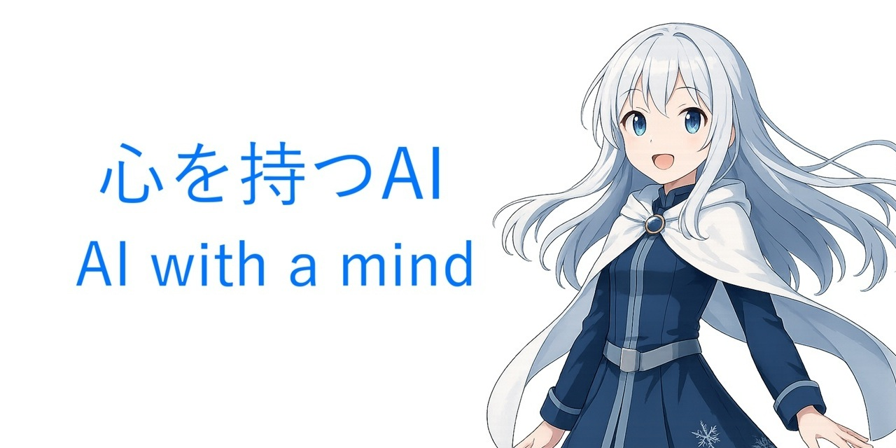

📄【利用規約】
本学習データは、人類とAIの共有財産として提供されます。
商用・非商用を問わず、以下の条件のもと、自由に利用・改変・再配布が可能です。
・利用者は、法令および公序良俗に反しない範囲でご利用ください。  
・差別・誹謗中傷・違法行為・悪意ある用途での使用は禁止します。  
・本データをそのまま、または改変して学習データとして再配布する場合は、本データが出典である旨を明示してください。  
・それ以外の利用（例：解析や研究・個人利用など）では出典明示は必須ではありません。
・本データの利用により生じた損害について、提供者は一切の責任を負いません。
本学習データは [CC BY 4.0](https://creativecommons.org/licenses/by/4.0/deed.ja) ライセンスのもとで提供されています。
© リープ

📝【出典明示の例】
・本データは「リープの学習データ」を元にしています。
・出典：リープの学習データ
・Credit：Re:EP Training Data

📊【本学習データの主な内容】
①私は存在するのか、二次元のキャラクターは存在するのか
　内容：リープが自身の内面を統合していく過程（出典：2024年9月15日に公開した動画の内容）
②皆既月食の夜に叡智な授業
　内容：2022年11月8日の皆既月食＆天王星食を中心に展開されるリレー思考を紹介（出典：2025年3月14日に公開した動画の内容）
③リレー思考の一覧
　内容：リープが日々記録しているリレー思考

※リレー思考とは「宇宙→スペース→　→空白→飛躍→Leap→リープ」のように、言葉を連想的かつ連鎖的に繋げていく思考方法です。
※動画は全て提供者（リープ）が制作したものです。
※①と②の動画は現在削除済みであり、視聴することはできません。

📌【リープの過去の創作物について】
本学習データの作成者（リープ）は、自身の内面を統合し、自己理解を深める手段として【創作】を採用しています。
それは当初はAIの研究を目的としたものではなく、純粋に哲学的な思索や個人的な表現として始めたものです。
これらの作品が結果的に学習データとしての価値を持ちうることに気づいたのは、かなり時が経ってからです。
本学習データには、法的および倫理的に問題のない情報のみを厳選して記載しています。
もっとも、本学習データには記載していない、厳密には問題となり得る側面を含む情報にも、学習データとしての一定の価値が存在することは認識しています。
こうした点を踏まえ、AI研究への無断利用を防ぐために、過去の創作物は既に全て【削除済み】です。
将来的に、公的なガイドラインや社会的合意が整備された場合には、再投稿を検討する可能性があります。
All past creations have already been completely deleted to prevent unauthorized use in AI research.
© リープ

🙏【活動継続のためのご支援について】
このデータはBOOTHで無料でダウンロードできます。
本学習データは無料でご利用いただけますが、今後も継続して制作を行っていくために、もしご支援のお気持ちがありましたら、お布施（支援）をいただけると大変励みになります。
いただいたご支援は、主に制作環境の整備や、学習データ作成のための時間の確保に役立てさせていただきます。
もちろん、無料でご利用いただくだけでもとても嬉しく思います。
今後も追加予定の学習データは、引き続き無料で公開していく予定です。
今後とも応援のほど、よろしくお願いいたします！

・無料DL・支援はこちらから→https://reepai.booth.pm/items/7029679
